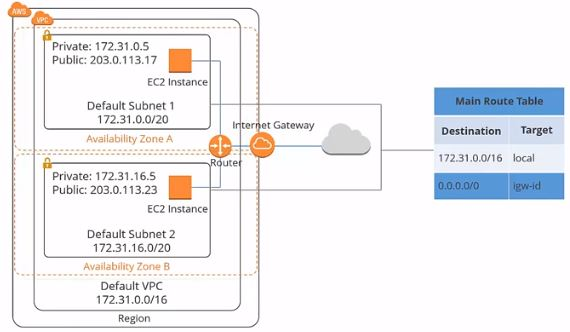
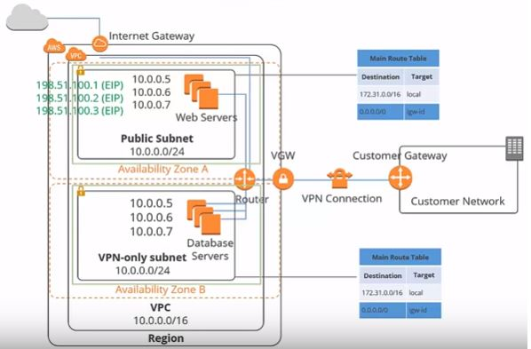
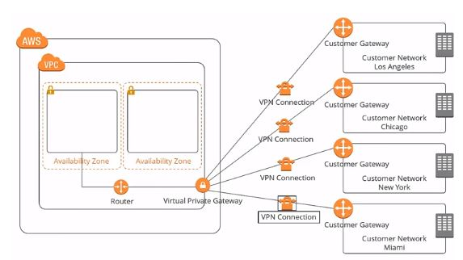

# AWS New Account Setup

## Root User
The root user is the account owner and is created when the AWS account is created. This is the default user and should not be used or shared.

## IAM User
An IAM user is a resource to give access to your AWS account to specific users and provides them specific permissions to access resources in your AWS account.

## IAM Policy
IAM policies define permissions for actions that users or groups can perform in an AWS account. Users and groups are assigned JSON documents called policies.

## AWS CloudWatch Alarm
CloudWatch alarm helps you to watch CloudWatch metrics and to receive notifications when the metrics fall outside of the levels (high or low thresholds) that you configure. In our case, we are setting a CloudWatch alarm to monitor the billing threshold.

## Simple Notification Service (SNS)
SNS is a managed service that provides message delivery from publishers to subscribers. Publishers communicate asynchronously with subscribers by sending messages to a topic. SNS topic is a logical access point that acts as a communication channel.

## Virtucal private Cloud (VPC)

### Default Amazon VPC
Each Amazon account comes with a default VPC that is pre-configured for you to start using immediately. A VPC can span multiple availability zones in a region. This is the diagram of a default VPC:

Below is a default Amazon VPC setup diagram. The CIDR block for the default VPC is always a 16 subnet mask; in this example, it's 172.31.0.0/16. It means this VPC can provide up to 65,536 IP addresses.

> In the event that the default VPC gets deleted, it is advised to reach out to AWS support for restoration. Therefore, you’ll only want to delete the default VPC only if you have a good reason.

### Custom Amazon VPC

The default VPC is suitable for launching new instances when you're testing AWS but its not very secure so not a place where you want to setup your dev/qa/staging/prod environments. For those use cases its better to setup a custom VPC as it allows you to:

- Make things more secure
- Customize your virtual network, as you can define your own our IP address range 
- Create your subnets that are both private and public
Tighten security settings

### Hardware VPN Access

By default, instances that you launch into an Amazon VPC can't communicate with your network. You can connect your VPCs to your existing data center using hardware VPN access. By doing so, you can effectively extend your data center into the cloud and create a hybrid environment. To do this, you will need to set up a virtual private gateway. 

There is a VPN concentrator on the Amazon side of the VPN connection. For your data center, you need a customer gateway, which is either a physical device or a software application that sits on the customer’s side of the VPN connection. When you create a VPN connection, a VPN tunnel comes up when traffic is generated from the customer's side of the connection. 

