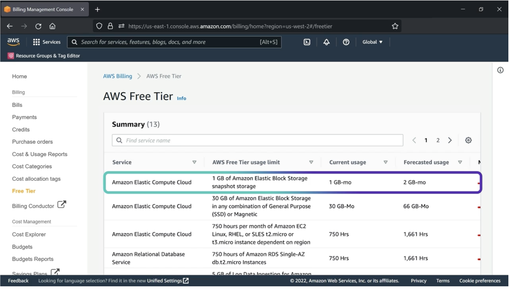
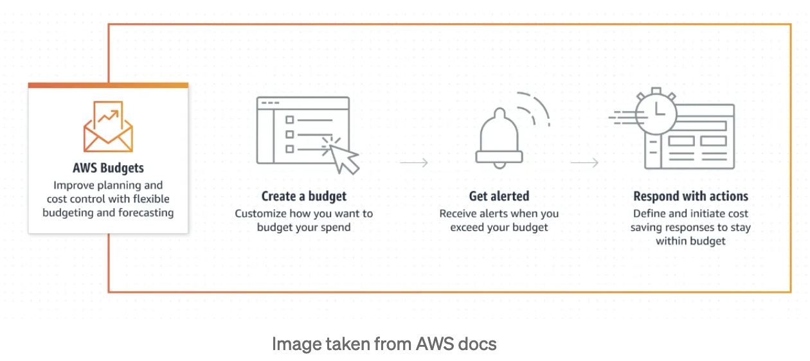
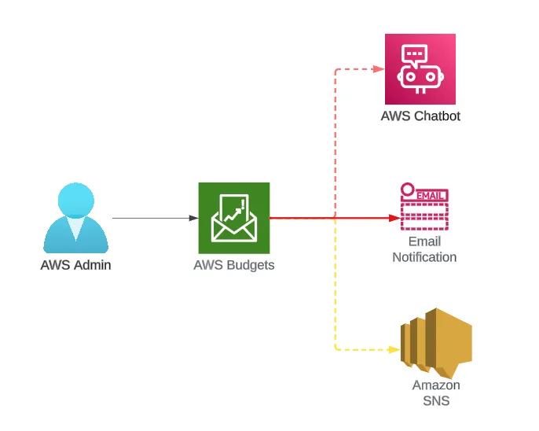
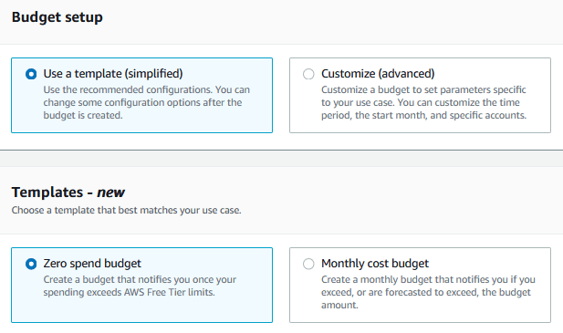
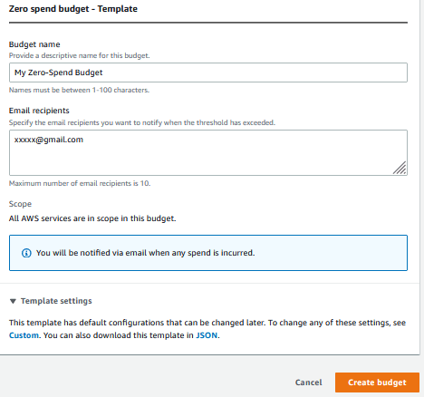
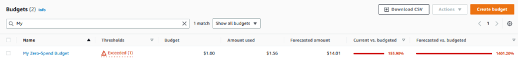

# AWS Free Tier Monitoring

Monitoring your service usage and associated cost while exploring AWS is often cited as a top concern. While using the AWS Free Tier, it's important to watch your usage to avoid going past your free tier limit unintentionally.

- The Free Tier page and Billing console
- AWS Budgets

These are just two of the many tools available but we'll focus on the basic navigation and features that can be helpful for those newer to AWS who are focused on learning how to monitor AWS cost and usage.

## Use AWS Billing console to track and confirm usage

While using the AWS Free Tier, it's important to watch your usage to avoid going past your free tier limit unintentionally.

If you're using AWS Free Tier offerings, you can track your usage with the free tier page from the AWS Billing console. Choose play to watch how you can monitor your free tier usage with the AWS Billing console.

From the Billing Console on the left-hand navigation pane, click on Free Tier to see the details about your Free Tier usage. The table includes additional information about your forecasted usage for each Free Tier service limit. Let's look at the first line item. We can see that with EC2 service, we have a Free Tier limit of one gigabyte of Elastic Block Storage snapshot storage. Our current usage is already at one gigabyte and our forecasted usage is at two gigabytes. This lets us know that we can continue to keep our snapshots outside of the Free Tier limits, or if we want, we can go and remove them. Now we know how to monitor our Free Tier usage using the Billing Console.

## AWS Budgets to manage costs

We recommend using AWS Budgets to create custom cost budgets that alert you when you exceed or are forecasted to exceed your budgeted threshold.

`AWS Budgets automatically notifies you by email when you exceed 85 percent of your free tier limit for each service.` Here are some additional options for creating a budget. The first option is to create a zero spend budget using a template. The second option is to use the monthly cost budget template to base alerts on a specific dollar amount. Choose each tab to learn different options for using AWS Budgets to manage costs.

AWS Budgets to track and take action on your AWS costs and usage. You can use AWS Budgets to monitor your aggregate utilization and coverage metrics for your Reserved Instances (RIs) or Savings Plans.Below are the benefits and features of AWS Budgets

1. AWS budgets is to set custom cost and usage budgets to easily manage your AWS spend. Monitor your budget status from the AWS Budgets overview.
2. Track your cost or usage across multiple dimensions by adding filters related to service, member accounts, Region, tags, and more.
3. Create and send daily, weekly, or monthly reports to monitor the performance of your AWS Budgets.
4. Get notified by email or publish updates to a Slack channel, Amazon Chime room, or Amazon SNS topic of your choice.
5. Define actions to reduce or prevent unbudgeted cost before it occurs. Decrease the need to monitor and respond to alerts to manage costs.

### Budget Types
You can create following types of budgets

1. Cost budgets — Plan how much you want to spend on a service
2. Usage budgets — Plan how much you want to use one or more services.
3. RI utilization budgets — Define a utilization threshold and receive alerts when your RI usage falls below that threshold.
4. RI coverage budgets — Define a coverage threshold and receive alerts when the number of your instance hours that are covered by RIs fall below that threshold.
5. Savings Plans utilization budgets — Define a utilization threshold and receive alerts when the usage of your Savings Plans falls below that threshold.
6. Savings Plans coverage budgets — Define a coverage threshold and receive alerts when your Savings Plans eligible usage that is covered by Savings Plans fall below that threshold.

### Budget Templates
There are basically three templates to choose from:

1. `Zero spend budget` - Create a budget that notifies you once your spending exceeds AWS Free Tier limits.

2. `Monthly Cost budget` - Create a monthly budget that notifies you if you exceed, or are forecasted to exceed, the budget amount.

3. `Daily Savings Plans coverage budget` - Create a coverage budget for your Savings Plans that notifies you when you fall below the defined target.

Anyone learning to utilize AWS free tier services should be using this template in order to avoid receiving an unexpectedly high AWS bill. Setting up this budget option is really simple. 

Below are the some use cases to use AWS budgets

1. Setting a monthly cost budget with a fixed target amount to track all costs associated with your account. You can choose to be alerted for both actual (after accruing) and forecasted (before accruing) spends.
2. Setting a monthly usage budget with a fixed usage amount and forecasted notifications to help ensure that you are staying within the service limits for a specific service. You can also be sure you are staying under a specific AWS Free Tier offering.
3. Setting a daily utilization or coverage budget to track your RI or Savings Plans. You can choose to be notified through email and Amazon SNS topics when your utilization drops below 80 percent for a given day.

### How it Works?
With AWS Budgets, set custom budgets to track your costs and usage, and respond quickly to alerts received from email or SNS notifications if you exceed your threshold.

Create a budget → Get alerted(Email, Chatbot, SNS) → Respond with actions

### Zero Dollar Budget
Step 1: Navigate to the AWS budget service page.

Step 2: Select "Use a template (simplified)" Budget setup option and "Zero spend budget" Template option.

Step 3: Enter the recipient's email address, who will be notified when the zero balance threshold has been exceeded. And finally, click the "Create budget" button to create the budget.

When you now navigate to the Budgets overview page, you will see your Zero Spend budget displayed in the list.

If you breach the zero spend threshold, you will now receive an email similar to the one I received below.

## Summary

- Use the Free Tier page from AWS Billing console to view your free tier usage.
    - Anyone beginning to use AWS free tier services for either building a simple application or simply learning AWS should at the very least set up an AWS budget using the template.
- Use AWS Budgets to create custom alerts that suit your usage monitoring needs.
    - Cost management is a critical requirement for all accounts. If you are exploring or creating some POC use cases, then recommendation would be use AWS Budgets to get alerts before spending a lot. It’s an useful AWS feature to track your cost and minimises your surprize bills.

## Refrences
- [Managing your costs with AWS Budgets](https://docs.aws.amazon.com/cost-management/latest/userguide/budgets-managing-costs.html) in the AWS Billing and Cost Management User Guide
- [Tracking your AWS Free Tier usage](https://docs.aws.amazon.com/awsaccountbilling/latest/aboutv2/tracking-free-tier-usage.html) in the AWS Billing and Cost Management User Guide
- [Creating a cost budget](https://docs.aws.amazon.com/cost-management/latest/userguide/budgets-create.html) in the AWS Billing and Cost Management User Guide
- [Announcement: 1-Click templates and tutorials in AWS Budgets](https://aws.amazon.com/about-aws/whats-new/2022/09/aws-budgets-1-click-templates-tutorials/)
- https://medium.com/@vanchi811/aws-cost-management-and-cost-control-using-aws-budgets-467df3b72227
