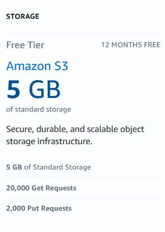

# AWS Free Tier

The AWS Free Tier is offered across 100-plus services and allows you to get hands-on experience with AWS services such as Amazon EC2, Amazon S3, and Amazon RDS. The AWS Free Tier provides three types of offers. Some services are free to a certain limit every month. Others are free up to 12 months, and some services are short-term free trials, typically 30 or 60 days. Knowing the differences between these tiers will equip you with more decision-making power as you begin your Free Tier journey and exploration of AWS services.

AWS Free Tier can be used for anything you want to run in the cloud, such as launching new applications, testing existing applications in the cloud, or simply getting hands-on experience with AWS.

## Types of AWS Free Tier offerings
Free tier consists of three distinct types of offerings. Knowing the free tier usage limit as well as the trial period length are important so you don't end up with a surprise bill later on.

- **`Free trials`** are short-term trial offers that begin when usage first begins. Once the trial period expires, you simply pay standard pay-as-you-go service rates. Services with a short-term trial are free to use for a specified period of time or up to a one-time limit depending on the service selected. 
- **`12 months free`** offers are only available to new AWS customers and are available for 12 months following your AWS sign-up date.
- **`Services with an always free`** offer allow you to use the product for free up to specified limits as long as you have a valid AWS account. 

Regardless of the free tier offering, you switch to standard pay-as-you-go rates when you exceed the free tier usage limit. Be sure to check out each service page for full pricing details and for more information, visit https://aws.com/free

## Who qualifies for AWS Free Tier?
AWS Free Tier is available to all types of customers–students, entrepreneurs, small businesses, and Fortune 500 companies are all welcome to sign up.

For example,

- You could be a student learning about AWS Cloud fundamentals.
    - EC2
    - S3
    - RDS
- You could be a small business owner who plans to launch your business website.
    - Amplify (Frontend Web and Mobile App development to quickly build scaleable full stack application )
    - LightSail (easy to use virtual private instances, containers, data storages)
    - HoneyCode (Programming without code)
- You might even be a senior manager of a large organization evaluating a machine learning experiment.
    - SageMaker (build, traing and deploy machine learning models with fully managed infrastructure)
    - Polly (Text to Speech)
    - Comprehend (Valuable insights from documents, product review, social media feeds etc.)

## Filter Free Tiers Services
1. Go to https://aws.com/free.
2. On this page, you can filter free tier services by free tier type or product category.
    
Let's say you wanted to see all compute services that are eligible in the 12 months free tier. Here we see that there's three services based on your filtering selection. For example, with EC2, you can use up to 750 hours per month of qualifying instance types. In this video, we reviewed how to locate free tier eligible products. In the next video, we'll take a deeper look into the usage limits of AWS Free Tier service offerings.

## Free Tier Limits
When will my free offering expire? Is one of the most common questions from AWS Free Tier users. What you should know: 

- **`Services with 12 months Free Tier`** offerings allow customers to use the product for free up to the specified limits for one year from the date the account was activated. - 
- **`Services with an always free offering`** allow you to use the product for free up to specified limits as long as you have a valid AWS account. 
- **`Services with a short-term trial`** are free to use for a specified period of time up to a one-time limit depending on the service selected. 

Keep in mind that when your Free Tier expires or if your application use exceeds the Free Tier limits, you simply pay standard pay-as-you-go service rates. Let's take DynamoDB as an example. This service is free up to 25 gigabytes of storage and up to 200 million read/write requests per month within the AWS Free Tier. So while it's considered an always free offering, Free Tier applies to certain participating AWS services up to a specified maximum amount of usage each month. Applicable services and usage limits are defined at aws.com/free. When transitioning out of the Free Tier, you can choose to terminate AWS resources or continue to use AWS services. Let's take a look at some of the best practices with these options when transitioning out of Free Tier.

## Verify your AWS service's Free Tier eligibility
After identifying service limit details, the next best practice is to verify a services Free Tier eligibility. What you need to keep in mind, is that free tier applies to certain participating AWS services up to a specific maximum amount of usage each month.  

When an account goes over the free tier limit, the standard AWS service rates will be billed to your credit card.

Let’s look at Amazon Simple Storage Service (Amazon S3) for example, and how it shows up on the AWS Free Tier page. From this image, you can do the following:

- Verify that the service is a part of the free tier offering for 12 months. 
- Find the specific amount of service that you can use. In this case, that’s 5 GB of standard storage, 20,000 Get Requests, and 2,000 Put Requests. 

Applicable services and usage limits are defined at aws.amazon.com/free(opens in a new tab).

## View active AWS resources
To view your AWS service charges, we'll open the billing console. You can get here by searching for billing. In the navigation pane on the left side, choose Bills. If you scroll down to the Details section, you can see all of the charges based on the service you're using. As you can see here, we are incurring charges with EC2 service. Let's expand the details of EC2 to identify the regions where the usage is occurring. If we expand again, we get a breakdown of the spend.

###### New Bill Dashboard

## Terminate active AWS resources
When transitioning out of the Free Tier, you can choose to terminate AWS resources or continue to use AWS services.

The first thing that we're going to do is search for EC2 in the search bar. Now, we're in the EC2 console. Make sure you are in teh right region, Once we're in the right region, you can see your instance running. To terminate the instance, you'll first select the instance, and then go to "Instance state" and "Terminate." Then it will ask if you're sure you want to terminate the instance.

## Transition from free to paid services

if you want to continue with the service? When the free offer ends, you pay standard, pay-as-you-go service rates.

Here’s how to review the resources that you're using on a monthly basis.

1. Sign in to the AWS Management Console, and then open the Billing console.
2. In the navigation pane, on the left side, choose Bills.
3. For Date, choose a month.
4. Check the AWS Pricing for any resources that you're using to decide what to keep.
5. If you do not terminate any resources on your account, you would be billed at the On-Demand rate.

https://aws.amazon.com/premiumsupport/knowledge-center/free-tier-expiring/

## AWS pricing models
AWS offers several pricing models depending on your product. These include:
- On-Demand
- Spot
- Commitment discounts - Savings Plans
- Commitment discounts - Reserved Instances

## AWS Pricing Calculator
AWS Pricing Calculator is a web-based planning tool that you can use to create estimates for your AWS use cases. You can use it to model your solutions before building them, explore the AWS service price points, and review the calculations behind your estimates. You can use it to help you plan how you spend, find cost saving opportunities, and make informed decisions when using AWS. Choose the play button, to watch a demonstration on the AWS Pricing Calculator.

First, to get to the Pricing Calculator, you can go to https://calculator.aws in your web browser. At the top of the page, you can see that we are able to create our estimate. We have some Getting started links and additional information on how Pricing Calculator works. Let's choose to Create estimate. Here you have two options. You can either search by location type or search by service. Let's filter by service and search for EC2, and then select Configure. We'll enter a description for our estimate. In the next section, we can enter our EC2 instance specifications. For the purposes of this demo, we'll leave everything as the default. We'll scroll to the bottom and click Save and View Summary. We'll see a message at the top that says we've successfully added our Amazon EC2 estimate, and here we can view the summary of our estimate. We can also export or share the summary to save it for later.

## AWS Cost Explorer
AWS Cost Explorer has an easy-to-use interface that lets you visualize, understand, and manage your AWS costs and usage over time. Here are some of the things you can do with it:

- Quickly create custom reports that analyze cost and usage data.
- Analyze your data at a high level (for example, total costs and usage across all accounts).
- Dive deeper into your cost and usage data to identify trends, pinpoint cost drivers, and detect anomalies.

The following is an example visualization of monthly costs by service usage within Cost Explorer. 

## Summary
So to summarize, here's a reminder on steps to take any time you explore a new AWS service within the AWS Free Tier. 

- Always use aws.com/free as your starting point for free resources and exploration. 
- Use the search options to locate the service that fits your need, making careful note of the service tier details. 
- Always be sure to click into the product link and review the service details and usage limits. 
- Cost Explorer is the place to visit to visualize and manage my AWS costs and usage over time
- Pricing Calculator is the place to go to create estimates for my AWS use cases and explore the AWS service price points
- Resources: Use the following list of resources to learn more about ways to manage your free tier usage. 
    - [Viewing your monthly bill](https://docs.aws.amazon.com/awsaccountbilling/latest/aboutv2/invoice.html) in the AWS Billing and Cost Management User Guide
    - [AWS pricing models](https://docs.aws.amazon.com/whitepapers/latest/how-aws-pricing-works/key-principles.html) in the AWS Whitepapers
    - [AWS Pricing Calculator](https://calculator.aws/)
    - [AWS Cost Explorer](https://aws.amazon.com/aws-cost-management/aws-cost-explorer/)