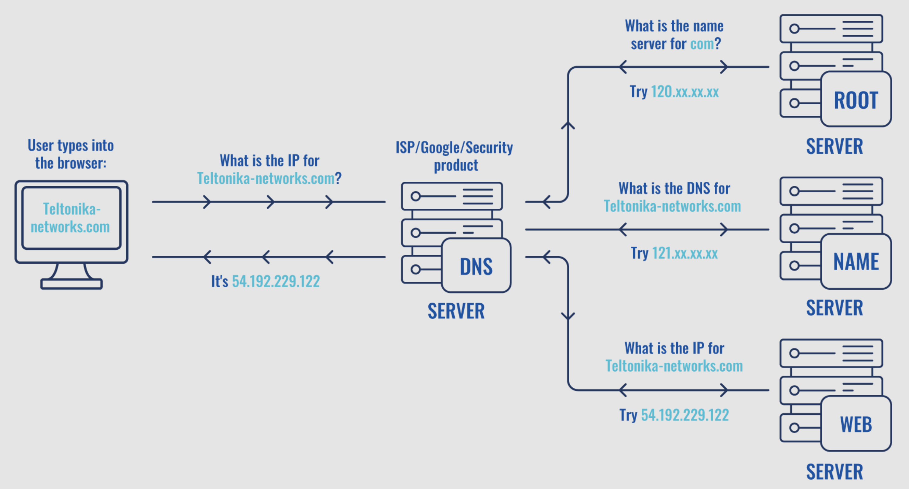
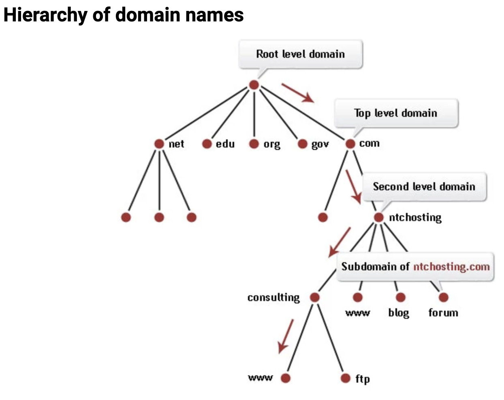
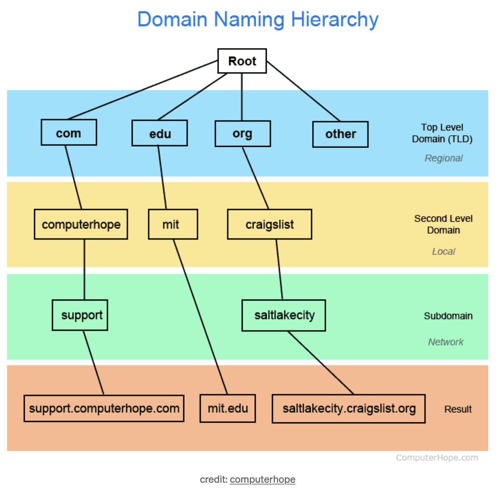
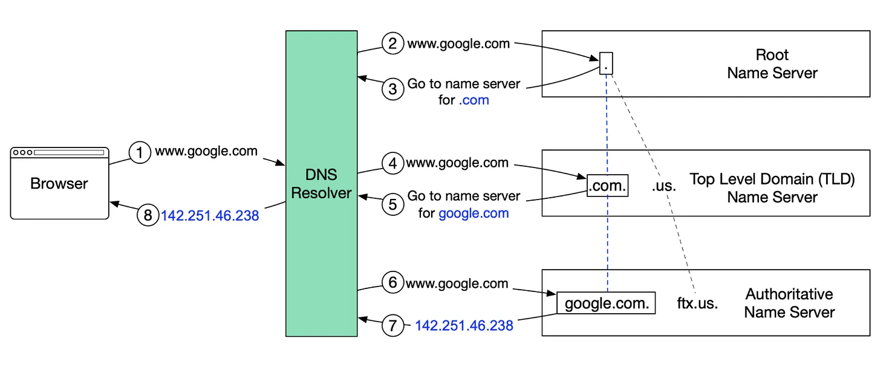
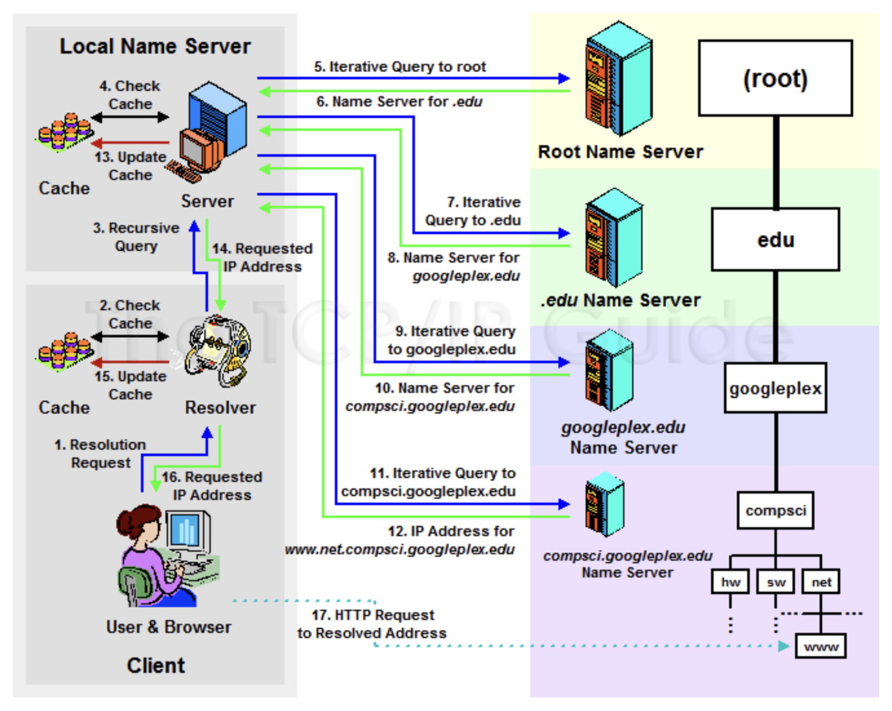
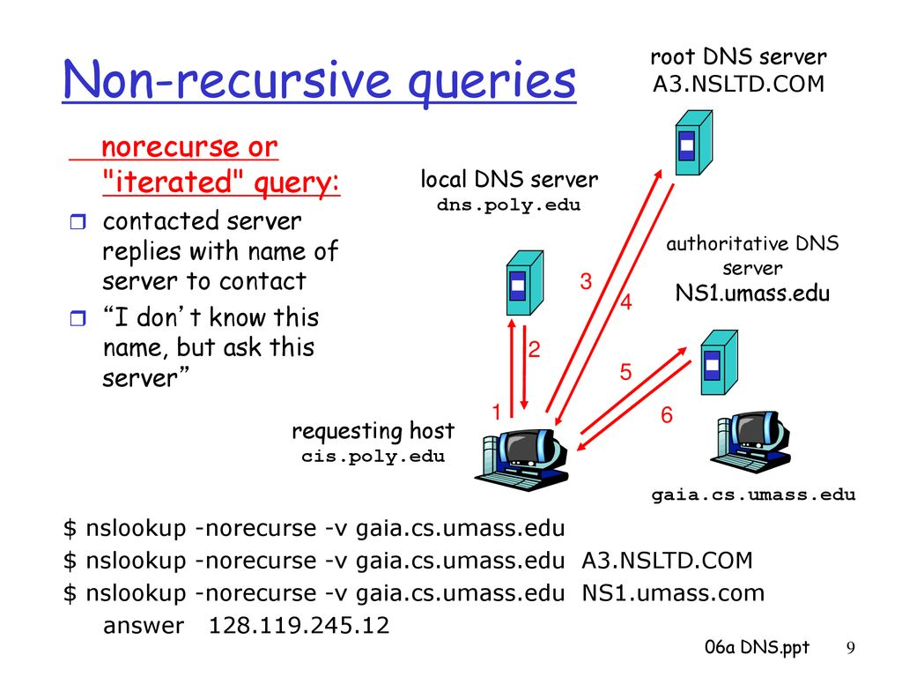
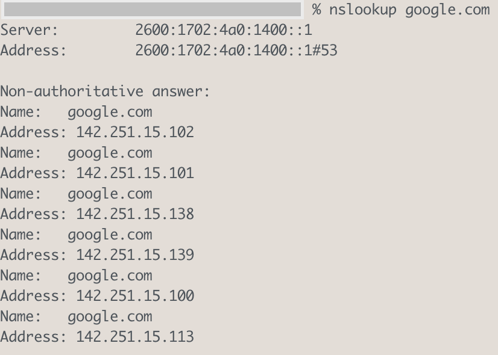
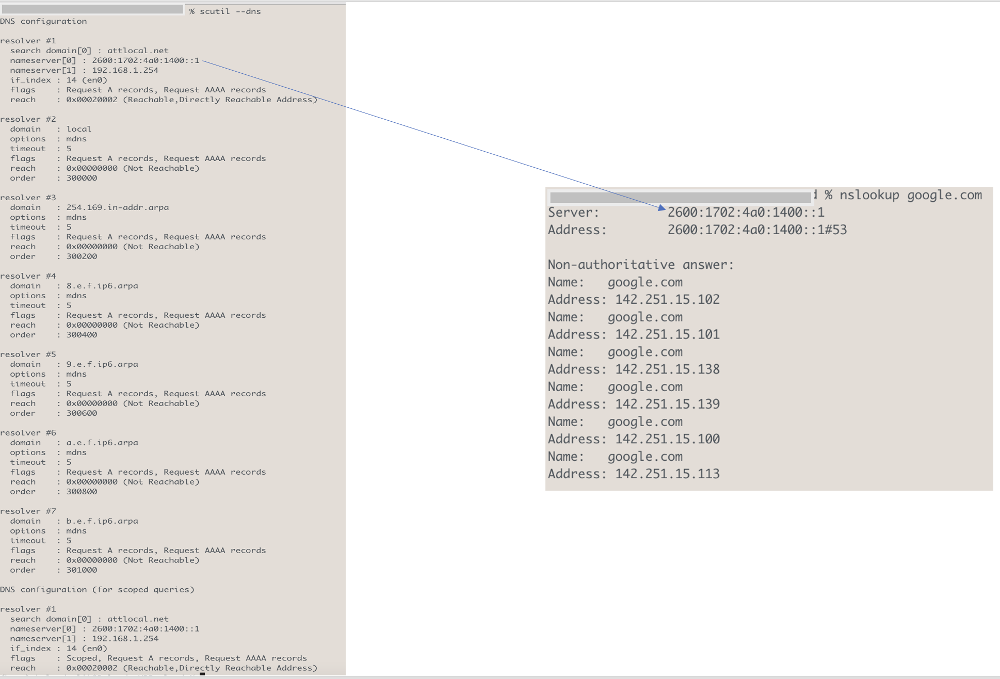

# Basic Networking Termninollogies - DNS

## What is a DNS?
Behind every site, there is an IP address. But, while it's easy to remember the name of a website, it's quite hard to remember the exact IP address. For example, everybody knows about Google.com, but if you had to remember "74.125.45.100", things would have been much harder. Thats where `DNS` comes into picture.

`DNS` or `Domain Name System` is a hierarchical and decentralized naming system for computers, services, or other resources connected to the Internet or a private network. Each device, connected to the internet have unique IP address, like 192.168.1.1 (IPv4) or 2001:db8:3333:4444:5555:6666:7777:8888 (IPv6), which help to identify device on a network. For humans is hard to memorize all these sequences of numbers and in this case helps DNS, which translates human readable webpage names, e.g., google.com, to computer friendly IP addresses. 

DNS, short for Domain Name System, is the essential service that saves us from the huge hassle of memorizing numeric IP addresses. It efficiently matches easy-to-remember domain names with their corresponding IP addresses so we can browse seamlessly.

## How it works?

Like showed in given example below, there are 4 DNS servers involved in a loading of a webpage. Once end user gives webpage address to a browser DNS recursor receive query and start giving request to others DNS servers to bring back webpage. A root server is responsible for looking a specific name server and last portion of a host name (in this example “com”). A name server is responsible to provide a DNS address for a DNS recursor, once request from it was made. Once website server gets command from DNS recursor it translate human readable host name to a machine understandable IP address and it bring back to machine. 

## DNS: The Internet’s Address Book
DNS is a distributed and hierarchical system that acts as the internet's address book. It translates domain names into IP addresses to facilitate efficient communication between devices across the globe. The primary purpose of DNS is to provide a convenient way for users to access websites and resources using easily memorable domain names, while computers and servers use IP addresses for communication behind the scenes.

The DNS is implemented as an Application layer service. It is implemented by the servers that sit at the network edge rather than routers and switches inside the network. This reflects the internet design philosophy of keeping the network core simple and putting complexity at the network’s edge.

## Key Services Provided by DNS
DNS provides a number of different services to facilitate the functioning of the Internet. Here is a mind map of the services provided by DNS.

We are going to describe some of the most vital services of DNS below:

### Host-to-IP address mapping
DNS maintains a database of domain names and their corresponding IP addresses. This mapping is essential for devices to locate each other on the internet.

For instance, consider the domain name "www.bulandmalik.com." Host-to-IP address mapping involves determining the IP address associated with this domain, such as "172.29.17.8"

### Host aliasing
DNS supports a feature commonly known as host aliasing, enabled through CNAME (Canonical Name) records. This allows a single IP address or primary domain name to be associated with multiple domain name aliases.

For example, let's consider the primary domain `bulandmalik.com`. You might want your website to be accessible various aliases like `www.bulandmalik.com`, `me.bulandmalik.com`, and `blog.bulandmalik.com`. By setting up appropriate CNAME records in DNS, all these aliases can point to the primary domain `bulandmalik.com`. As a result, users can access your website using any of these domain names, all leading to the same destination IP address.

#### DNS CNAME Records

- **Primary Domain:** `bulandmalik.com`
- **Aliases:**
  - `www.bulandmalik.com`
  - `me.bulandmalik.com`
  - `blog.bulandmalik.com`

#### CNAME Record Setup:

1. **www.bulandmalik.com:**
   - **Type:** CNAME
   - **Value:** `bulandmalik.com`

   This CNAME record directs traffic from `www.bulandmalik.com` to the primary domain `bulandmalik.com`.

2. **me.bulandmalik.com:**
   - **Type:** CNAME
   - **Value:** `bulandmalik.com`

   Similar to the first record, this CNAME record points `me.bulandmalik.com` to the primary domain.

3. **blog.bulandmalik.com:**
   - **Type:** CNAME
   - **Value:** `bulandmalik.com`

   Similarly, this CNAME record associates `blog.bulandmalik.com` with the primary domain.

#### Result:

By setting up these CNAME records, all three aliases (`www.bulandmalik.com`, `me.bulandmalik.com`, and `blog.bulandmalik.com`) will resolve to the same destination IP address, which is the IP address associated with `bulandmalik.com`. Users can use any of these aliases to access the website, and the DNS will route the requests to the correct server.

This setup is commonly used for providing multiple access points to a website and is particularly helpful when you want to offer a consistent experience regardless of which alias users use to reach your site.

### Email Routing
DNS plays a crucial role in email routing through MX records. These records allow a domain to specify which mail servers are responsible for receiving email messages on its behalf. This mechanism enables flexibility in email configurations.

For example, let's say the primary mail server designated to receive emails for the `bulandmalik.com` domain is "mail.bulandmalik.com". You might want to have specific email addresses, such as those ending in `@support.bulandmalik.com`, yet still direct all incoming mail for these addresses to the `mail.bulandmalik.com` server. By configuring MX records appropriately, emails sent to any of these addresses will route to the designated primary mail server.

### IP-to-host address mapping
While DNS is primarily used for translating domain names to IP addresses, it can also perform reverse lookups, translating IP addresses back to domain names. This is useful for security and logging purposes.

### Load balancing
DNS can distribute incoming network traffic across multiple servers by returning different IP addresses in response to the same domain name query. This helps balance the load and improve the performance and reliability of online services.

## DNS Hierarchy

Sourced from https://www.ntchosting.com/encyclopedia/dns/domain-name-system/

Sourced from bytebyte.com

### Root DNS Servers
These servers are the “roots” of the DNS service. They are the servers initially contacted when attempting DNS resolution, and respond back to clients with the IP address of the relevant Top-Level Domain Server for the client’s request.

Root servers act like the central nervous system of the internet, and as such, security is going to be very important. Much of the infrastructure associated with the root servers is the responsibility of ICANN (Internet Corporation for Assigned Names and Numbers). **`There are 13 logical root servers around the world, but each of these logical root servers is actually replicated, so corresponding to these 13 logical servers are actually close to a thousand physical servers around the world (1381)`**. You can track this information at https://root-servers.org/

### Top-Level Domain (TLD) DNS servers 
TLD servers are the partitioning level for specific domain types e.g. .com, .edu etc. They are the second point of contact for DNS resolution, and return back to the client the IP address of an authoritative server for the given domain.

It stores the IP addresses of authoritative name servers. There are several types of TLD names. For example, generic TLD (.com, .org), country code TLD (.us), test TLD (.test).

The Internet Corporation for Assigned Names and Numbers (ICANN) has authority over all TLDs used on the Internet, and it delegates the responsibility of these TLDs to various organizations. For individuals or entities looking to register a new domain under these TLDs, they typically approach Domain Name Registrars, which are accredited entities interfacing with the registries to handle the registration process.

### Authoritative DNS servers
These are the servers which provides actual answers to the DNS query. They will return back the corresponding IP address for the client’s requested domain name. In cases where a domain itself may have sub-domains (e.g. maps.google.com is a sub-domain of google.com), an authoritative server may deflect again, returning an IP address to another authoritative server tasked with handling DNS resolution for this sub-domain. Note that these authoritative servers may be managed directly by the domain owner, or through a DNS service provider.

The Authoritative Name Server is the last stop in the name server query-it takes the hostname and returns the correct IP address to the DNS Resolver (or if it cannot find the domain, returns the message NXDOMAIN).

While various caching mechanisms exist across the internet to speed up domain name resolutions, it's the authoritative servers that provide the correct and final answer when queried. Domain owners or administrators configure their domain's records, but the actual infrastructure—the DNS servers—is often maintained and operated by DNS hosting providers or registrars like Cloudflare, Namecheap, GoDaddy, and others.

You can register authoritative name servers with domain name registrar such as GoDaddy, Namecheap, Verisign etc. 

### Recursive DNS Servers (Resolver)
A DNS resolver (recursive resolver), is designed to receive DNS queries, which include a human-readable hostname such as “www.example.com", and is responsible for tracking the IP address for that hostname.

Recursive servers temporarily store information they've previously retrieved, but when that information isn't available in cache, they have to get it from another server.

Recursive servers handle DNS queries from client devices like computers and smartphones. When a device wants to resolve a domain name, it contacts these servers. Acting on behalf of the client, recursive servers traverse the DNS hierarchy, consulting various DNS servers to determine the IP address associated with a domain name. Once they obtain the answer, they return it to the client. For efficiency, recursive servers often cache responses to avoid repeatedly querying the same information.

### Local Name Server
A local DNS server, also known as a "resolver," is a server that is used to resolve domain names to IP addresses within a local network.

Though we’ve talked about the levels of DNS hierarchy above, there is an additional player involved in servicing DNS resolution requests, known as the local name server. This server stands between clients and the DNS hierarchy, and executes the set of requests described above on behalf of clients, starting with the root name servers, all the way down to the authoritative servers, ultimately returning back to the client the IP address they will need to send network requests to the desired domain.

Local name servers can additionally cache DNS mappings that have been requested in the past, returning these cached results to the client, to reduce the load on the root servers, and to reduce the number of repetitive DNS resolutions requested by the client. (There is also additional OS-level DNS caching on client machines).

## DNS Name Resolution Process

The process involves fundamental components like browser, your computer’s operating system, your internet service provider (ISP) , the server where you host the site and the services running on that server.

Now, suppose you are an employee within XYZ Industries and one of your clients is in charge of the networking department at Googleplex U. You type into your Web browser the address of this department's Web server, “www.net.compsci.googleplex.edu”. In simplified terms, the procedure would involve the following set of steps (Below diagram also depicts same):

1. Your Web browser recognizes the request for a name and invokes your local resolver, passing to it the name “www.net.compsci.googleplex.edu”.

2. The resolver checks its cache to see if it already has the address for this name. If it does, it returns it immediately to the Web browser, but in this case we are assuming that it does not. The resolver also checks to see if it has a local host table file. If so, it scans the file to see if this name has a static mapping. If so, it resolves the name using this information immediately. Again, let's assume it does not, since that would be boring.

3. The resolver generates a recursive query and sends it to “ns1.xyzindustries.com” (using that server's IP address, of course, which the resolver knows).

4. The local DNS server receives the request and checks its cache. Again, let's assume it doesn't have the information needed. If it did, it would return the information, marked “non-authoritative”, to the resolver. The server also checks to see if it has in its zone resource records that can resolve “www.net.compsci.googleplex.edu”. Of course it does not, in this case, since they are in totally different domains.

5. “ns1.xyzindustries.com” generates an iterative request for the name and sends it to a root name server.

6. The root name server does not resolve the name. It returns the name and address of the name server for the “.edu” domain.

7. “ns1.xyzindustries.com” generates an iterative request and sends it to the name server for “.edu”.

8. The name server for “.edu” returns the name and address of the name server for the “googleplex.edu” domain.

9. “ns1.xyzindustries.com” generates an iterative request and sends it to the name server for “googleplex.edu”.

10. The name server for “googleplex.edu” consults its resource records. It sees, however, that this name is in the “compsci.googleplex.edu” subdomain, which is in a separate zone. It returns the name server for that zone.

11. “ns1.xyzindustries.com” generates an iterative request and sends it to the name server for “compsci.googleplex.edu”.

12. The name server for “compsci.googleplex.edu” is authoritative for “www.net.compsci.googleplex.edu”. It returns the IP address for that host to “ns1.xyzindustries.com”.

13. “ns1.xyzindustries.com” caches this resolution. (Note that it will probably also cache some of the other name server resolutions that it received in steps #6, #8 and #10; I have not shown these explicitly.)

14. The local name server returns the resolution to the resolver on your local machine.

15. Your local resolver also caches the information.

16. The local resolver gives the address to your browser.

17. Your browser commences an HTTP request to the Googleplex machine's IP address.

Sourced: Mohamed AbukarMohamed Abukar

## How DNS Resolution Works?
There are two main methods of query resolution in DNS:

- Iterative query resolution
- Recursive query resolution

### Iterative Query Resolution

In iterative query resolution, the DNS server receiving the query provides referrals to the querying server, guiding it through the DNS hierarchy. The querying server actively participates in the process by sending subsequent queries based on the referrals received. 

### Recursive Query Resolution
In recursive query resolution, the DNS server receiving the query takes on the responsibility of finding the IP address on behalf of the client. It may itself use iterative queries to navigate through the DNS hierarchy until it reaches the authoritative DNS server for the requested domain. 

When a client sends a recursive request to a name server, the server responds back with the answer if it has the information sought. If it doesn't, the server takes responsibility for finding the answer by becoming a client on behalf of the original client and sending new requests to other servers. The original client only sends one request, and eventually gets the information it wants (or an error message if it is not available).

## DNS Types: 10 Top DNS Record Types

DNS servers create a DNS record to provide important information about a domain or hostname, particularly its current IP address. The most common DNS record types are:

- **`Address Mapping record (A Record)`** - also known as a DNS host record, stores a hostname and its corresponding IPv4 address.
- **`IP Version 6 Address record (AAAA Record)`** - stores a hostname and its corresponding IPv6 address.
- **`Canonical Name record (CNAME Record)`** - can be used to alias a hostname to another hostname. When a DNS client requests a record that contains a CNAME, which points to another hostname, the DNS resolution process is repeated with the new hostname.
- **`Mail exchanger record (MX Record)`** - specifies an SMTP email server for the domain, used to route outgoing emails to an email server.
- **`Name Server records (NS Record)`** - specifies that a DNS Zone, such as “example.com” is delegated to a specific Authoritative Name Server, and provides the address of the name server.
- **`Reverse-lookup Pointer records (PTR Record)`** - allows a DNS resolver to provide an IP address and receive a hostname (reverse DNS lookup).
- **`Certificate record (CERT Record)`** - stores encryption certificates-PKIX, SPKI, PGP, and so on.
- **`Service Location (SRV Record)`** - a service location record, like MX but for other communication protocols.
- **`Text Record (TXT Record)`** - typically carries machine-readable data such as opportunistic encryption, sender policy framework, DKIM, DMARC, etc.
- **`Start of Authority (SOA Record)`** - this record appears at the beginning of a DNS zone file, and indicates the Authoritative Name Server for the current DNS zone, contact details for the domain administrator, domain serial number, and information on how frequently DNS information for this zone should be refreshed.

## DNS resolution Example

What the above response is telling us is the following:

- The DNS server which serviced our request (returned us the IP) is 192.168.50.1, and the port used is port 53 (this is a well-defined port reserved for DNS)
- The Non-authoritative answer to our request is that the domain google.com maps to the IP address 142.250.69.206

Now you may be asking, what does it mean when the response specifies the answer is non-authoritative? As we discussed earlier, we expect DNS resolution to be handled eventually by an authoritative server, so from this description we can make the conclusion that that was not the case, and in fact, the server which returned us the IP address was in fact not an authoritative server.

What this means is that this DNS resolution was handled by our local DNS server. This server is not an authoritative server, but since it caches DNS mappings, it has the capacity to provide an answer to DNS resolutions for domains which it has already serviced a request for in the past. (my guess is, nslookup for google.com will yield a non-authoritative answer for any of you following along as well)

### What’s my Local DNS server?

On Linux, we may try the below command, to check the resolver.conf file on our machine (this file stores information about the local DNS server configuration):

On OS X, this is in fact not the reference I want to check (as the message so helpfully describes), but instead, we can check the local DNS server as done below:

Unpacking this a little further, we know the following information about our local DNS server:

- The IP address of the server is 192.168.50.1 (confirming our hypothesis from earlier)
- The network interface its corresponding resolver is associated with is en0 (this is a well-defined network interface for wi-fi)
- We interact with this server by requesting A records (another way of saying what we get back is IP addresses)

