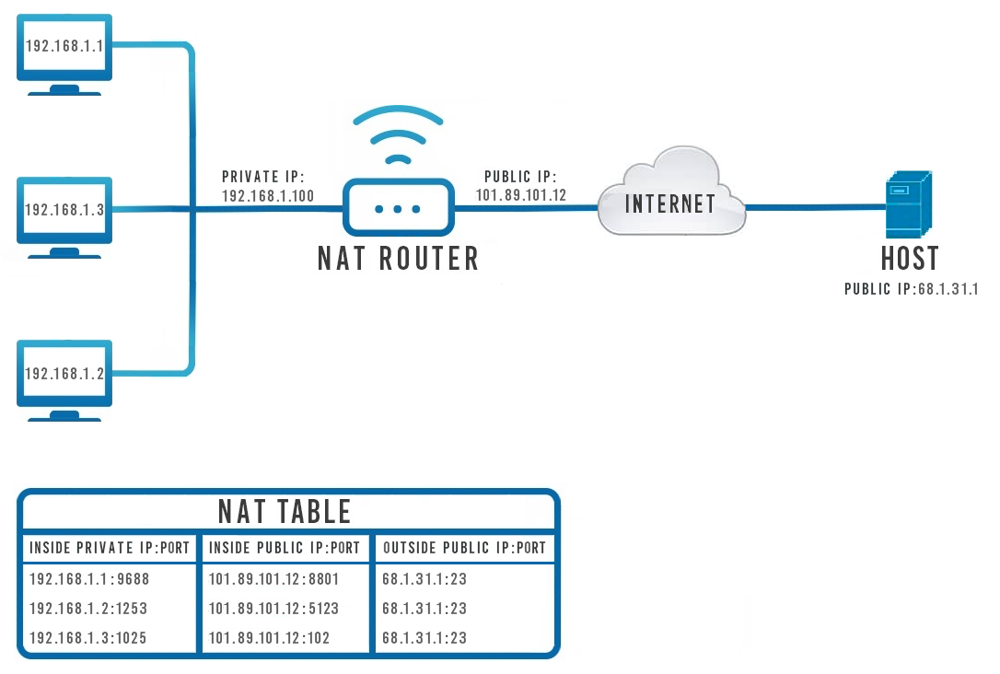
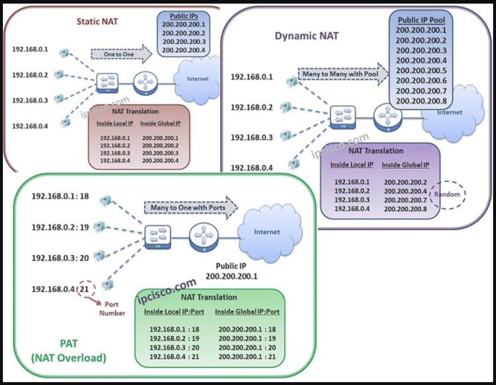

# Basic Networking Termninollogies - NetMasking

## What is a Netmask?
A Netmask is a 32-bit "mask" (8bits.8bits.8bits.8bits = 32bits) used to divide an IP address into subnets and specify the network's available hosts. In a netmask, two bits are always automatically assigned. For example, in 255.255.225.0, "0" is the assigned network address. In 255.255.255.255, "255" is the assigned broadcast address. The 0 and 255 are always assigned and cannot be used.

Netmask defines how "large" a network is or if you're configuring a rule that requires an IP address and a Netmask, the Netmask will signify to what range of the Network the rule will apply to: 

| IP               | NETMASK            | DESCRIPTION                              |
|------------------|-------------------|------------------------------------------|
| 192.168.55.161   | 255.255.255.255   | Only applies to 192.168.55.161            |
| 192.168.55.0     | 255.255.255.0     | Applies to IPs in the 192.168.55.0 - 192.168.55.255 range |
| 192.168.55.240   | 255.255.255.240   | 192.168.55.240 - 192.168.55.255           |
| 192.168.55.161   | 255.255.255.0     | 192.168.55.0 - 192.168.55.255             |
| 192.168.0.0      | 255.255.0.0       | 192.168.0.0 - 192.168.255.255            |

## Network Address Translation

Network address translation (NAT) is a method of remapping one IP address space into another by modifying network address information in IP header of packets while they are in transit across a traffic routing device. Or to put it in plain terms, NAT allows devices with private IP addresses to communicate with hosts via the internet using IP masquerading. 

With NAT (Network Address Translation), we can use a Private IP Address millions of times all over the world inside our networks and still we can access to the Internet. Here, Network Address Translation provides the translation from Private IP Address to the Public IP Address. We are connecting Internet with our Private IP Address, but in real at the backplane, our router is connecting Internet via Public IP Address.

With NAT, not only Private to Public IP Address translation is used. Beside, Public to Puclic or Private to Private translations are also done via Network Address Translation. But the first one is most common.

Network Address Translation is also used for Network Security. With NAT you can hide your network from the outside of the world. Because by using various types of NAT, the remote node that you connect over Internet, only knows your Public IP Address. It do not have any idea about your local Private IP Address.

### Why do we need NAT?
When the Internet was in its infancy and before IP addresses were first created, responsible engineers had to decide how long an IP address should be. Since data is exchanged through the Internet via data packets and every data packet has to contain the sender's and receiver's IP addresses, the length of an IP address would determine how large packets would be. A short IP address would mean smaller data packets but fewer possible IP addresses and vice versa.

`32-bit length IP addresses were chosen and this is what we call IPv4 today`. A 32-bit length means that there can be 232 or 4,294,967,296 distinct IP addresses which is not nearly enough to meet the demand of today's internet savvy society - with over 7 billion people in the world and countless more devices there is just no way that only 4.2 billion unique address would suffice. NAT solves this problem by applying a method that remaps one IP address space into another by modifying network address information in the IP header of packets. This way multiple devices can use one Public IP address to send and receive packets through the Internet. 

### How NAT Works?
NAT works by applying `IP masquerading`, which is a technique that hides an entire IP address space, usually consisting of private IP addresses, behind a single IP address in another, usually public address space. 

The address that has to be hidden is changed into a single (public) IP address as a "new" source address of the outgoing IP packet so it appears as originating not from the hidden host but from the routing device itself: 

NAT works by having a firewall act as an intermediary for traffic entering and leaving the protected network. Inbound traffic is directed to a public-facing IP address, which is translated to an internal IP address to the firewall before sending the traffic on to its destination. Outbound traffic’s source addresses are similarly updated from private, internal IP addresses to public, external ones.

The technology works similarly to many organizations’ phone systems. The company publishes a single, public number for external callers. Once a customer calls this number, they are transferred to a specific internal phone based upon the details of their request.

The scheme above roughly describes how devices with private IP addresses communicate with a remote host on the Internet (and vice versa) with the help of NAT. Bellow the scheme is a depiction of a NAT forwarding table. It illustrates how the router differentiates to which device in the local network to redirect incoming data packets. But lets go through the example step-by-step:

Lets say a user behind the computer with the IP address 192.168.1.3 wants to check a news site whose address is 68.1.31.1. The computer generates a package containing its IP address, the destination IP address and the request to access website. The computer cannot send the packet through the Internet directly to the website's IP address as it would not receive any response. This is because the host would not know how to reach the computer's IP address of 192.168.1.3 since there might be thousands of devices using that same IP address at any given moment.

This is where NAT comes in. Instead of sending the package directly to the host, it goes through the router who then changes the sender's IP address into its own Public IP Address:port, in this case 101.89.101.12:8801.So now when the host receives the package it knows exactly where to send the response. It then generates a response package and sends it to 101.89.101.12:8801. The router then receives that response on the specific port and knows exactly where to re-route it - to 192.168.1.3:102 

### Types of Network Address Translation
NAT can be implemented in a few different ways, including:

- **Static NAT**: Static NAT maps an internal IP address to an external one on a one-to-one basis. This doesn’t help with the scalability of IPv4 but does make a system reachable from outside of the network without disrupting internal addressing schemes.
- **Dynamic NAT**: With Dynamic NAT, a firewall has a pool of external IP addresses that it assigns to internal computers as needed. Like Static NAT, this creates a one-to-one mapping between internal and external IP addresses; however, these mappings are not permanent.
- **Port Address Translation (PAT)**: PAT is used to create many-to-one mappings between internal and external IP addresses. The firewall uses the same IP address for multiple systems but assigns a different TCP or UDP port to each. Since a single IP address can have 65,535 ports associated with it, PAT allows a single external IP address to represent thousands of devices on a private network. PAT is the application of NAT that allows IPv4 addresses to scale.

