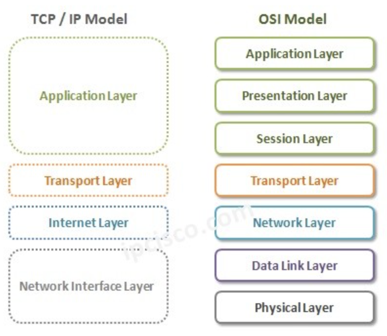

# Basic Networking Termninollogies - TCP IP Model

## What is a TCP/IP Model?
TCP IP Model is another important referance model beside `OSI Model` in network world. OSI Referance Model was Seven Layered model, TCPIP Model is Four Layered or Five Layered Model. The four layer model is old one. The new one is five layered tcpip model. In common, they model the same thing. But, borders of the Layers of different models, are different.

## How it works?

