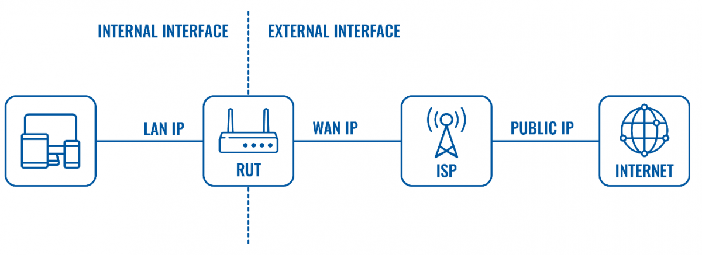
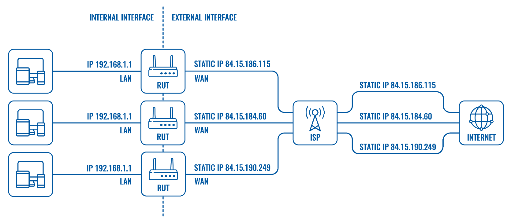
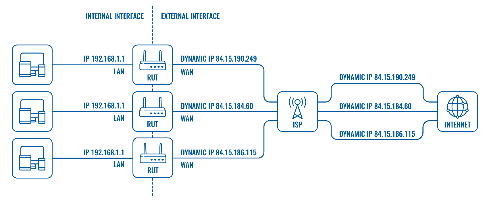
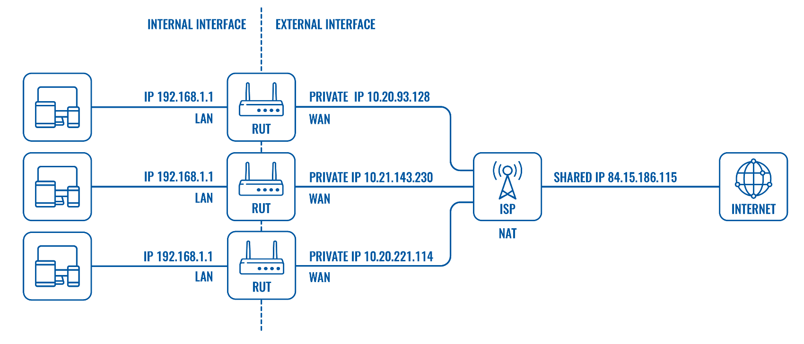

# Basic Networking Termninollogies - IP Addresses

## Private and Public IP Addresses
A router or another Internet-capable machine will typically have two types of network interfaces: internal & external.

Any network interface must have an IP address in order to communicate inside or outside of the network. There are two types of IP addresses (in terms of accessibility, uniqueness & naming conventions): public and private. 

### Public IP address
An IP address is a number used to identify a host on an IP (Internet Protocol) network. `In order to successfully communicate on the Internet or any other computer network, a machine must have a network interface and an IP address assigned to it that is unique to that network`.

A public IP address is an IP address that is unique to the entire Internet. Public IPs can be accessed globally; therefore, they are often used by publicly accessible entities such as websites, DNS and VPN servers, etc.

The number of different public IPv4 addresses is limited and they are usually assigned to a device by an Internet Service Provider (ISP).

### Static IP address

Public static - some times called Dedicated - means the IP address never changes and is tied to a single user, device, server or website. 

The example above depicts a scenario where the Internet Service Provider (ISP) provides different routers with IP addresses that are unique and constant (they never change for each device). In this case the router performs the NATing process instead of the ISP, thefore the ISP is "transparent" when the router sends or receives data from remote hosts on the internet.

Most users don't need static IP addresses, however, a static IP address matters a lot when external devices, websites or users need to remember your IP address for constant use. For example, if you require constant remote access to a device. Since the IP address never changes you or other users need to remember only one IP address to reach the device at any given time. 

### Dynamic IP address

Public dynamic - means the IP address can change from time-to-time (for example, when you lose connection and re-connect or the ISP might change the address periodically).

From the example above we can see that in case of dynamic IP addresses the ISP provides the routers with private WAN IP addresses that are then "translated" into public IP addresses when connecting to remote hosts on the internet. The main difference from static IP addresses is that the dynamic IPs provided by the ISP are not permanent. They will change when the router disconnects and reconnects, re-registers to a network operator or, in some cases, the ISP might update the IP addresses periodically.

Speaking in terms of remote access, dynamic IPs complicate the situation because there is no way to tell what IP address a remote has at any given time. While remote access is more complicated with dynamic IP addresses, it is not impossible and can be achieved using the Dynamic DNS service (Services → Dynamic DNS). `DNS or Domain Name Service provides names (such as www.google.com, www.facebook.com) for IP addresses`. `Dynamic DNS` periodically rebinds IP addresses to a hostname. Therefore, when using Dynamic DNS you would only have to remember the hostname to reach a specific device at any given time even though its IP address might change from time to time. 

### Shared IPs

Public shared - in some cases, an ISP can assign a public IP address to a group of users, and then employ NAT to isolate their traffic.

In the example above we can see that it is possible for multiple devices (even websites) to share a single public IP address. An ISP provides clients with private WAN IP addresses and then uses NAT to differentiate to which host specific data packets should be directed to.

However, shared IPs have a huge disadvantage since an owner of a device or website is no longer the only entity responsible for their IP address. For example, if one the multiple users of the same IP address commits an online felony of some sort and the IP address gets blocked, all of the users using that IP will get blocked as well.

You can find more information on Network Address Translation (NAT) here. 

### Private IP address

Private IP address (Internal) is only used by devices communicating to each other on the same network. Devices with private IP addresses cannot connect to the Internet directly. Likewise, computers or other devices outside the local network cannot connect directly to a device with a private IP.

`An IP address is considered private if the IP number falls within one of the IP address ranges reserved for private networks such as a Local Area Network (LAN)`. The Internet Assigned Numbers Authority (IANA) has reserved the following three blocks of the IP address space for private networks (local networks):

- 10.0.0.0 - 10.255.255.255 (Total Addresses: 16,777,216)
- 172.16.0.0 - 172.31.255.255 (Total Addresses: 1,048,576)
- 192.168.0.0 - 192.168.255.255 (Total Addresses: 65,536)

### IP Address Terminology

- **Static** means the IP address never changes as long as you stay with the same provider or same server.

- **Dynamic** means the IP address can change from time-to-time.

- **Public** means the IP address can be reached via the Internet from any computer in the world.

- **Private** means the IP address can only be reached by other devices on the same network.

- **Shared** means other people besides you use your IP address for their connection.

- **Dedicated** means no one else uses your IP address for their connection.

- **Class** identifies the range of your IP address and the default subnet mask. Examples of IP classes:

    - A class - 0 to 127 with default mask of 255.0.0.0
    - B class - 128 to 191 with default mask of 255.255.0.0
    - C class - 192 to 223 with default mask of 255.255.255.0
    - D class - 224 to 247 (not currently used)
    - E class - 248 to 255 (not currently used)

