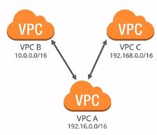
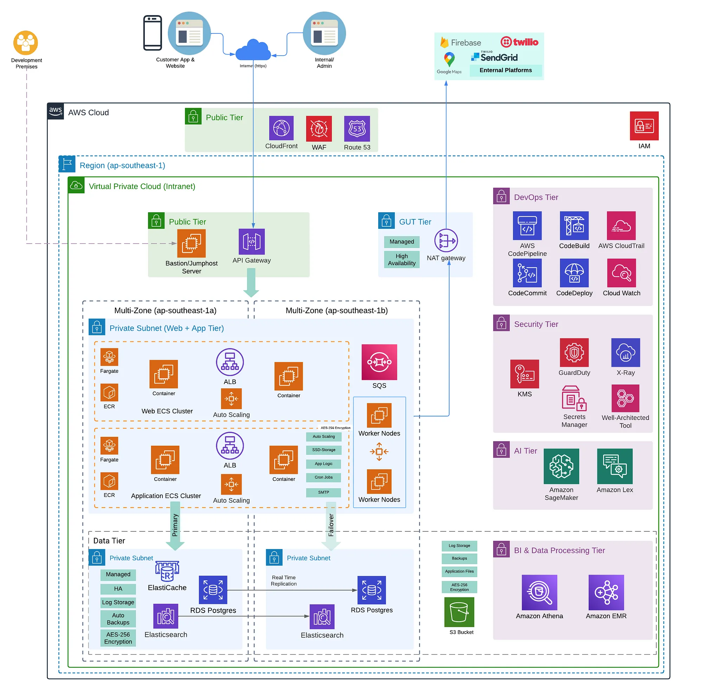

# AWS Network High Level Details

## Region
**Definition:** A geographical area in which AWS has data centers. Each region is completely independent and isolated from the others.

As of December 2023, AWS has `32 Launched Regions` each with multiple Availability Zones (AZs).

Please lookout and read about [AWS Global Infrastructure](https://aws.amazon.com/about-aws/global-infrastructure/).

**Key Points:**
  - Regions consist of multiple Availability Zones.
  - Users can select a specific region to host their AWS resources.
  - Services can also be region specific. (not all services available acrtoss all regions). You can read more about it [here](https://aws.amazon.com/about-aws/global-infrastructure/regional-product-services/)

## Availibility Zone (AZ)
**Definition:** A data center or a group of data centers within a region. Each Availability Zone is isolated but connected to other zones within the same region.

As of December 2023, AWS has 102 Availability Zones.

**Key Points:**
  - Designed to be independent, with its own power, cooling, and networking.
  - Multiple AZs in a region provide high availability and fault tolerance.
  

## Route 53 (R53)
*Definition:** Amazon Route 53 is a scalable and highly available Domain Name System (DNS) web service provided by Amazon Web Services (AWS). It is designed to route end-user requests to globally distributed AWS resources.

**Key Features:**
  - **DNS Management:** Route 53 allows users to register and manage domain names and perform DNS routing.
  - **Scalability:** It scales automatically to handle a large volume of DNS queries.
  - **High Availability:** Route 53 is designed for high availability and fault tolerance.
  - **Integration:** Seamlessly integrates with other AWS services and resources.

**Use Cases:**
  - Domain registration and management.
  - DNS routing for web applications, APIs, and other AWS resources.
  - Load balancing traffic across multiple resources.

## Virtual Private Cloud (VPC)

**Definition:** A logically isolated section of the AWS Cloud where you can launch AWS resources.

A virtual private cloud (VPC) is a virtual network dedicated to your AWS account. It is logically isolated from other virtual networks in the AWS Cloud. You can launch your AWS resources, such as Amazon EC2 instances, into your VPC.

A VPC spans all the Availability Zones (AZ) in a region. It is always associated with a CIDR range (both IPv4 and IPv6) which defines the number of internal network addresses that may be used internally.

Amazon Web Services (AWS), a leading cloud service provider, offers several services to integrate local resources with the cloud seamlessly. One such service is the Amazon Virtual Private Cloud (VPC).

**Key Concepts:**
  - **CIDR Block:** A range of IP addresses for your VPC.
  - **Subnet:** A range of IP addresses in your VPC.
  - **Route Table:** A set of rules, called routes, that are used to determine where network traffic is directed.
  - **Internet Gateway (IGW):** Enables communication between instances in your VPC and the internet.

## Private, Public, and Elastic IP Addresses

### Private IP Address
IP addresses not reachable over the internet are defined as private. Private IPs enable communication between instances in the same network. When you launch a new instance, a private IP address is assigned, and an internal DNS hostname allocated to resolves to the private IP address of the instance. If you want to connect to this from the internet, it will not work. You would need a public IP address for that. NAT GW are used typically for this purpose.

### Public IP Address
Public IP addresses are used for communication between other instances on the internet and yours. Each instance with a public IP address is assigned an external DNS hostname too. Public IP addresses linked to your instances are from Amazon's list of public IPs. On stopping or terminating your instance, the public IP address gets released, and a new one is linked to the instance when it restarts. 

> For retention of this public IP address even after stoppage or termination, an elastic IP address needs to be used.

### Elastic IP Address (EIP)
**Definition:** A static IPv4 address designed for dynamic cloud computing.

Elastic IP addresses are static or persistent public IPs that come with your account. If any of your software or instances fail, they can be remapped to another instance quickly with the elastic IP address. An elastic IP address remains in your account until you choose to release it. A charge is associated with an Elastic IP address if it is in your account, but not allocated to an instance.

**Usage:** 
- Typically associated with EC2 instances for a persistent public IP.
- NAT GW also assigned to have an EIP for 3rd party services that need to block incoming traffic and only allows certain IP's to make sure only their customers incoming traffic is allowed.

## Internet Gateway (IGW)

*Definition:** A horizontally scaled, redundant, and highly available VPC component that allows communication between instances in your VPC and the internet.

**Key Points:**
  - Enables instances in a VPC to connect to the internet and vice versa.
  - Acts as a gateway for traffic entering or leaving the VPC.

**Usage:** Typically attached to a VPC and associated with a route in the main route table.

## Subnets

**Definition:** A range of IP addresses in your VPC.

Within the VPC, we create subnets that are specific to AZs. 

A subnet is a way for you to divide your little cloud of IP addresses into smaller groups of IPs. This way, you can make one part of your virtual cloud public while keeping other parts of the cloud private.

It is possible to have multiple subnets in the same AZ. The purpose of subnets is to internally segregate resources contained in the VPC in every AZ. AWS Regions consist of multiple Availability Zones for DR purposes.

**Types:**
  - **Public Subnet:** Directly accessible from the internet.
  - **Private Subnet:** Not directly accessible from the internet.

### Public Subnet

A `public subnet` is a subnet that has traffic routed to an internet gateway. Its for resources that need to be accessible from the internet. 

Instances in a public subnet usually have a route to an Internet Gateway (IGW), allowing them to send and receive traffic directly from the internet.

Security:

    Public subnets may have a Network Access Control List (ACL) and Security Group rules allowing inbound and outbound traffic as needed.

### Private Subnet

Instances in a private subnet typically do not have direct access to the internet.

If instances in a private subnet need to access the internet, they do so via a `Network Address Translation (NAT) gateway` or `NAT instance` located in a public subnet.

Private subnets are used for resources that should not be directly accessible from the internet, such as databases, application servers, or internal services.

Security:

    Private subnets often have stricter security controls. They may have limited inbound traffic to enhance security.

Isolation:

    Private subnets provide an additional layer of isolation and security by limiting direct exposure to the internet.

## Route Tables
**Definition:** A set of rules used to determine where network traffic is directed.

**Associations:**
  - **Main Route Table:** Automatically associated with the main subnet.
  - **Custom Route Table:** Created and associated with custom subnets.

## NAT Gateway
**Definition:** Network Address Translation (NAT) gateway to enable instances in a private subnet to initiate outbound traffic to the internet.

**Usage:**
- Often used in private subnets for outbound internet access.
- 

## Security Group
**Definition:** Acts as a virtual firewall for your instance to control inbound and outbound traffic.

**Rules:**
- Specify allowed inbound and outbound traffic.
- Two-Way Traffic: Security Groups are stateful, meaning if you allow inbound traffic, the corresponding outbound traffic is automatically allowed.
- Simplified Rules: You define rules to allow traffic, and the Security Group automatically allows the response traffic. Its becaus eits statefull in nature.

## Network ACL (Access Control List)
**Definition:** An optional layer of security for your VPC that acts as a firewall for controlling traffic in and out of one or more subnets.
**Rules:**
- Define rules for allowing or denying traffic.
- Two-Way Traffic: NACLs are stateless, so you must define separate rules for inbound and outbound traffic.
- Explicit Rules: If you allow inbound traffic, you need to explicitly allow the corresponding outbound traffic, and vice versa. Its because its stateless in nature.

## SG Vs NACL

| Feature                     | Security Groups                  | Network ACLs                       |
|-----------------------------|----------------------------------|-----------------------------------|
| **Level**                   | Instance (Layer 4)               | Subnet (Layer 3)                  |
| **Statefulness**            | Stateful                         | Stateless                         |
| **Rules**                   | Allow rules                      | Allow and deny rules              |
| **Default Action**          | Default deny; Explicit allow     | Default deny; Explicit allow      |
| **Scalability**             | Associated with multiple instances | Associated with a single subnet |
| **Changes**                 | Immediate effect                 | Changes may take some time       |
| **Logging**                 | Limited logging capabilities      | More extensive logging capabilities |

**Use Cases:**

- **Security Groups:** Controlling access to instances based on rules.
  
- **Network ACLs:** Setting rules for traffic entering or leaving a subnet.

**Summary:**

- Use **Security Groups** for instance-level control.
  
- Use **Network ACLs** for subnet-level control.

> In practice, a combination of both Security Groups and Network ACLs is often used for comprehensive network security in AWS.

## VPN (Virtual Private Network)
**Definition:** A secure connection between your on-premises equipment and your VPC.
**Usage:** Enables communication between your on-premises network and your AWS resources.

By default, instances that you launch into an Amazon VPC can't communicate with your network. You can connect your VPCs to your existing data center using hardware VPN access. By doing so, you can effectively extend your data center into the cloud and create a hybrid environment. To do this, you will need to set up a virtual private gateway. 

There is a VPN concentrator on the Amazon side of the VPN connection. For your data center, you need a customer gateway, which is either a physical device or a software application that sits on the customer’s side of the VPN connection. When you create a VPN connection, a VPN tunnel comes up when traffic is generated from the customer's side of the connection. 

## Direct Connect
**Definition:** Establishes a dedicated network connection from your on-premises data center to AWS.
**Usage:** Provides a more reliable and consistent network experience compared to internet-based connections.

## Peering
**Definition:** Connection between two VPCs that enables instances in either VPC to communicate with each other.

A peering connection can be made between your own VPCs or with a VPC in another AWS account, as long as it is in the same region.

If you have instances in VPC A, they wouldn't be able to communicate with instances in VPC B or C unless you set up a peering connection. Peering is a one-to-one relationship; a VPC can have multiple peering connections to other VPCs, but transitive peering is not supported. In other words, VPC A can connect to B and C in the above diagram, but C cannot communicate with B unless directly paired.

> Additionally, VPCs with overlapping CIDRs cannot be paired. In the diagram, all VPCs have different IP ranges. If they have the same IP ranges, they wouldn't be able to pair.

## Transit Gateway
**Definition:** A network transit hub that you can use to interconnect your VPCs and on-premises networks.

## CloudFront
**Definition:** A content delivery network (CDN) service that securely delivers data, videos, applications, and APIs to customers globally.

 

## AWS Enterprise Architecture Cheat Diagram

The way to define the blueprint is to segregate the services into the following tiers:

### Public Tier
The services accessible from outside AWS and act as frontline services to secure the underlying services. Even the developers have to first log in to the Jumohost VM via VPN and then are able to access the other services.

### Private Application Tier
This tier is our core where all the web and application servers reside. Mainly you deploy all your containers/VMs here. You can always decouple all you microservices here and use a message broker like SQS to decouple.

### Private Data Tier
Your database and storage services come here. Some companies still prefer to host their Database (PostgreSQL, MySQL, MongoDB), Elastic Search and Redis inside EC2 than using the managed RDS, Elasticache, CloudSearch service, which is not a problem at all, but an architecture decision.

### Gut Tier
All the communication going outside to any ERP, CRM, or other external services has to be centrally managed by a NAT gateway which is only public for the external services, and our application core services remain protected from being exposed to outside. 

`It also has static IP (Elastic IP/EIP)` so if any 3rd party service(s) requires to allow only certain IP's as per their firewall rules (Firewall as of tofay do not except DNS/FQDN) so these static IP's will be shared to those 3rd party services.

### Security Tier, DevOps Tier, AI Tier, BI & Data Processing Tier
We can either use open souce services like Terraform Vault, Metabase, Kafka, Spark and Jenkins or we can use AWS managed services to address our use case.

Keep a note of which services are Zonal, Regional and Global. For example:

1. `WAF, Route 53, CloudFront, and IAM` are global services.
2. `S3 Bucket` is Regional.
3. `EC2/ECS` is Zonal.

This architecture fits as a base for any domain be it eCommerce, Healthcare, Loyalty, Ed-tech or Fintech app.

> Above diagram and description credit goes to 
[Karan Sehgal](https://medium.com/@karansehgal_11686/aws-enterprise-architecture-cheat-diagram-c31fc4a00f48)

## Something Else
