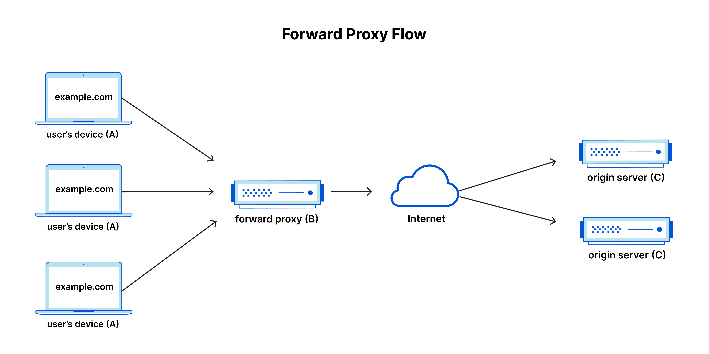
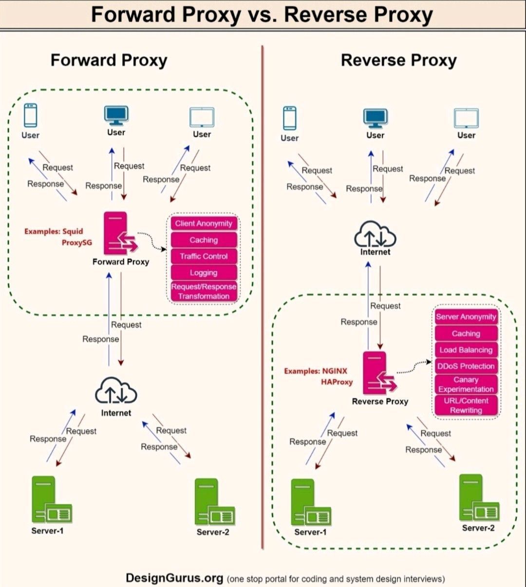
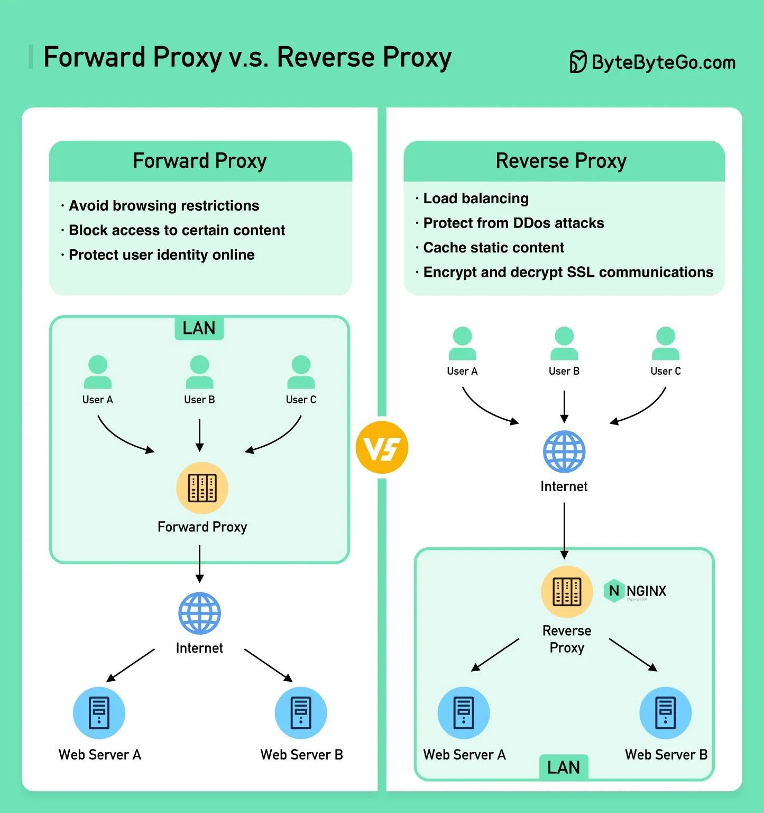

# Proxy Servers

## What is a proxy server/Forward Proxy?
A forward proxy, also known as a "proxy server," or simply "proxy," is a server that sits in front of one or more client machines and acts as an intermediary between the clients and the internet. When a client machine makes a request to a resource on the internet, the request is first sent to the forward proxy. The forward proxy then forwards the request to the internet on behalf of the client machine and returns the response to the client machine.

A forward proxy is a server that sits between user devices and the internet.

As the the proxy server intercepts those requests and then communicates with web servers on behalf of those clients, like a middleman.

A forward proxy is mostly used for:

• Improving privacy and security by hiding the real IP address and location of the client making the request.

• Accessing content that is restricted by network policies, such as geoblocking or content filtering.

• Caching frequently requested content to improve performance and reduce bandwidth usage.

• Enabling anonymous browsing and preventing tracking of online activity.

• Managing and controlling access to the internet by restricting or blocking certain types of content or websites.

• Enforcing security policies by scanning and filtering incoming traffic for malicious content or viruses.

• Providing bandwidth optimization and compression for slow or unreliable network connections.

For example, let’s name 3 computers involved in a typical forward proxy communication:
- A: This is a user’s home computer
- B: This is a forward proxy server
- C: This is a website’s origin server (where the website data is stored)

In a standard Internet communication, computer A would reach out directly to computer C, with the client sending requests to the origin server and the origin server responding to the client. When a forward proxy is in place, A will instead send requests to B, which will then forward the request to C. C will then send a response to B, which will forward the response back to A.

Why would anyone add this extra middleman to their Internet activity? There are a few reasons one might want to use a forward proxy:

- **`To avoid state or institutional browsing restrictions`** - Some governments, schools, and other organizations use firewalls to give their users access to a limited version of the Internet. A forward proxy can be used to get around these restrictions, as they let the user connect to the proxy rather than directly to the sites they are visiting. `Basically to avoid browsing restrictions`.
- **`To block access to certain content`** - Conversely, proxies can also be set up to block a group of users from accessing certain sites. For example, a school network might be configured to connect to the web through a proxy which enables content filtering rules, refusing to forward responses from Facebook and other social media sites.
- **`To protect their identity online`** - In some cases, regular Internet users simply desire increased anonymity online, but in other cases, Internet users live in places where the government can impose serious consequences to political dissidents. Criticizing the government in a web forum or on social media can lead to fines or imprisonment for these users. If one of these dissidents uses a forward proxy to connect to a website where they post politically sensitive comments, the IP address used to post the comments will be harder to trace back to the dissident. Only the IP address of the proxy server will be visible.

## What is a reverse proxy?
- A reverse proxy is a server that sits in front of web servers and forwards client (e.g. web browser) requests to those web servers. Reverse proxies are typically implemented to help increase security, performance, and reliability. In order to better understand how a reverse proxy works and the benefits it can provide, let’s first define what a proxy server is.

- A reverse proxy, also known as an "inbound" proxy, is a server that receives requests from the Internet and forwards them to a small set of servers, typically located on an internal network. It provides a point of control and can provide security, logging, and even load balancing. The client is unaware it is communicating with a set of servers instead of a single server.

- A reverse proxy is a server that sits in front of one or more web servers and acts as an intermediary between the web servers and the Internet. When a client makes a request to a resource on the internet, the request is first sent to the reverse proxy. The reverse proxy then forwards the request to one of the web servers, which returns the response to the reverse proxy. The reverse proxy then returns the response to the client.

- A reverse proxy is a server that accepts a request from the client, forwards the request to web servers, and returns the results to the client as if the proxy server had processed the request.

A reverse proxy protects servers from traffic by intercepting requests and managing them.

Reverse proxies are used to control and protect access to servers in internal networks, manage SSL encryption, or serve static content.

A reverse proxy is mostly used for:

• Load balancing and distributing incoming traffic across multiple servers or backend services.

• Caching frequently requested content to reduce server load and improve performance.

• Security and protection of backend servers by filtering and blocking malicious traffic or unauthorized access attempts.

• Providing SSL/TLS termination to offload the encryption/decryption processing from backend servers.

• Enabling content-based routing and redirection based on the requested URL, domain, or headers.

• Serving as a single point of entry and authentication for multiple backend applications or services.

• Simplifying the configuration and management of backend servers by abstracting them behind a single hostname or IP address.

## Difference between Forward vs reverse Proxy
The difference between a forward and reverse proxy is subtle but important. A simplified way to sum it up would be to say that a forward proxy sits in front of a client and ensures that no origin server ever communicates directly with that specific client. On the other hand, a reverse proxy sits in front of an origin server and ensures that no client ever communicates directly with that origin server.

