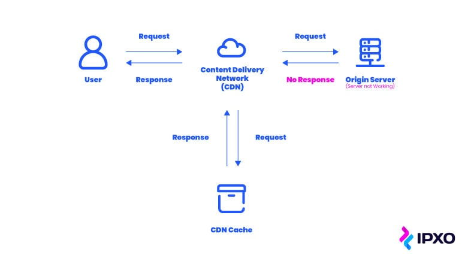

## Content Delivery Networks (CDN)
When it comes to putting together a killer website, speed is just as important as an attractive design and good content. Even your biggest fans will be yelling obscenities at their screens if your site takes too long to load, so it’s important to get page speed under control.

Site load speed is determined by various factors, with a key one being server location. Simply put, the further away the server is, the longer it takes for it to process requests – and this is where content delivery networks come to the rescue.

CDNs use a decentralized system of servers around the globe to display your website far faster than most hosting providers can. They’re not a hosting solution per se, just a middleman between you and your visitors.

By placing these data centers in strategic locations around the world, CDNs enable their customers to serve data more efficiently to end users by fulfilling their requests sooner. When a user makes a request to a site employing a CDN, it’s handled by the server based closest to them, resulting in lower latencies.

Say you’re running a streaming platform. If a user makes requests from halfway around the world from where your content exists, the bandwidth consumption and load times might be unacceptably high. This could impact the viewers’ experience negatively. 

This is where a content delivery network comes in handy. By strategically distributing content on CDN servers around the world, the content is available to end-users from a nearby CDN server, rather than going from an origin server that could be on a different continent. 

Ultimately, it all saves time, money, energy and server resources. 

A **Content Delivery Network (CDN)** is a distributed network of servers strategically positioned across the globe to enhance the performance, availability, and security of web content delivery. CDNs work by caching and delivering static assets, such as images, stylesheets, and scripts, from servers geographically closer to end-users, reducing latency and optimizing page load times.

## Key Features:

- **Global Distribution:** CDNs replicate and store content on multiple servers worldwide, ensuring fast and reliable access for users regardless of their location.

- **Performance Optimization:** 
    - By delivering content from servers closer to end-users, CDNs significantly improve website performance, reducing page load times and enhancing the overall user experience. 
    
    - The folks over at KeyCDN ran a simple experiment, testing the speed of a website already optimized for speed, then deployed a CDN before running the numbers again. It resulted in a 38.24% decrease in load times.

- **Load Balancing:** CDNs distribute traffic across multiple servers, preventing overloading of a single origin server and ensuring consistent performance even during traffic spikes.

- **Security Enhancements:** Many CDNs offer security features, including DDoS protection, web application firewalls (WAF), and SSL/TLS support, safeguarding websites from various online threats.

- **Scalability:** CDNs facilitate scalable content delivery, allowing websites to handle increased traffic and ensuring a seamless user experience during periods of high demand.

- **Mobile Optimization:** CDNs optimize content delivery for mobile devices, improving the performance and responsiveness of websites on smartphones and tablets.

- **Media Streaming Support:** CDNs specialized in media delivery enable smooth playback of audio and video content, enhancing the multimedia experience for users.

- **SEO Benefits:** Faster page load times, a result of CDN optimization, contribute positively to Search Engine Optimization (SEO) by improving a website's ranking in search engine results.

In summary, CDNs play a crucial role in optimizing the delivery of web content, providing benefits such as improved performance, scalability, security, and a better overall user experience.

## Do You Need to Use a Content Delivery Network?
The decision to use a Content Delivery Network (CDN) depends on various factors related to your website or application, its audience, and your specific requirements. 

A significant number of website operators would answer that question positively, since almost nine million websites currently use CDN services to optimize their performance. Furthermore, nearly 50% of the top 10,000 websites as ranked by Quantcast employ CDN solutions as of 2016.

Here are some considerations to help you determine if using a CDN is necessary for your situation:

1. **Geographical Distribution of Audience:**
   - If your audience is distributed globally, a CDN can significantly improve the performance of your website by caching and delivering content from servers located closer to the end-users. This reduces latency and speeds up page load times.

2. **High Traffic Volumes:**
   - CDNs are beneficial for handling high volumes of traffic and preventing your origin server from becoming a bottleneck. They can distribute the load across multiple servers, ensuring a better user experience during traffic spikes.

3. **Improved Website Performance:**
   - CDNs can optimize the delivery of static assets, such as images, stylesheets, and scripts, leading to faster page load times. This optimization is achieved through techniques like caching, compression, and minification.

4. **Security and DDoS Protection:**
   - Many CDNs provide security features such as DDoS protection, web application firewalls (WAF), and SSL/TLS support. Utilizing a CDN can enhance the security posture of your website.

5. **Global Scalability:**
   - If you plan to scale your website globally, a CDN helps in efficiently scaling your content delivery infrastructure. It allows you to reach users in different regions without having to set up and manage servers in each location.

6. **Cost Considerations:**
   - While CDNs can improve performance, they also come with costs. Consider your budget and weigh the benefits of improved performance against the associated expenses. Some CDNs offer flexible pricing models based on usage.

7. **Mobile Optimization:**
   - CDNs can optimize content delivery for mobile devices, reducing load times and improving the mobile user experience. This is crucial as a growing number of users access websites from mobile devices.

8. **Media Streaming:**
   - If your website involves streaming audio or video content, CDNs specialized in media delivery can ensure seamless playback and a better user experience.

9. **Search Engine Optimization (SEO):**
   - Faster page load times, which can be achieved through CDN optimization, are a positive factor for SEO. Search engines often favor websites with faster load speeds.

10. **Control over Content:**
    - CDNs provide control over how content is cached and delivered. This control is beneficial for ensuring consistency in content delivery and managing cache settings.

In summary, while a CDN is not mandatory for every website, it can offer substantial benefits in terms of performance, scalability, security, and user experience, particularly for websites with a global audience or high traffic volumes. Evaluate your specific needs, the characteristics of your audience, and the content you deliver to make an informed decision about whether to implement a CDN.

## How does a CDN handle requests?

Let’s say you are an internet user and want to load some static content, like a web page. This is the process a CDN will go through to deliver your content.

1. When a user in your geographic area requests data for the first time, the CDN transfers the data files from the original host web server. 
2. This data transmits via the edge server that is nearest to your device. 
3. The edge server caches a copy of the data. 
4. When the user requests the same content, the data transmits from the edge server rather than the origin host server. 

## What are the components of a cloud CDN?

- **`Servers`** with large amounts of storage and RAM store and deliver cached files to users, accelerating the load times of websites and reducing bandwidth consumption.
    - **`Origin server`**
        - An origin server is a server that hosts the original version of the content that users might request. If you’re not using a CDN, all user requests go to this server.
        - Without a CDN, the origin server is prone to long loading times (as every request hitting the same origin server might be far away from actual user and it also impacts performance), availibility issues (as same server serving all reqwuests and that server has specific capacity so could become bottleneck for example during sudden spikes), overload and DDoS attacks. 
    - **`Edge server`**
        - CDN edge servers are servers that are distributed around the world. They can receive and cache content from origin servers. 
        - An edge server sits at the edge of the network to be physically closer to the end-user. The shorter distance means that you need less time and bandwidth to send data from the server to the user. 
        - The user consuming the content can enjoy faster load times and a better experience on web pages and apps. 
- **`Points of presence (PoPs)`**
    - A point of presence (PoP) is a physical location where a company or organization has an edge server located. It can send, receive and cache data. 
    - These are data centers distributed around the world that serve content to nearby users. PoPs reduce the time required to serve content to a user’s device.
- **`Caching`**
    - Caching is the secret sauce that makes CDN services work so effectively. 
    - In general terms, cashing refers to the temporary storage of copied data. A cache is a temporary storage location for that data. 
    Related to CDNs, the edge CDN server acts as a cache that creates copies of content like images, HTML or Javascript files, and media files. Users access these copies instead of accessing the original version of the data on the origin server. 
- **`Cloud load balancing`** technology seamlessly directs traffic to the PoPs that can serve content to a user fastest, evenly distributing the load across cloud resources and achieving greater cloud optimization.
- **`Solid-state drives (SSD), hard disk drives (HDD), and random-access memory (RAM)`** within cloud CDN servers store files to be served, with the most requested files being stored on the fastest media.

## What is cloud computing vs. cloud CDN?

- **`Cloud computing`** provides on-demand access to computing, storage, and networking resources with a pay-as-you-go pricing model. Clouds rely on hundreds of data centers around the world with virtualized machines running on servers that allow multiple users to access computer resources as needed. 
- **`A cloud CDN`** is a collection of servers that distribute content from an origin server throughout the world, caching content close to where each end user will access it. By caching content physically close to the users that request it, CDNs help to significantly reduce latency.

## The Best Content Delivery Networks Compared
- CloudFlare (Freemium)
    - [Cloudflare](https://www.cloudflare.com/) is a globally distributed network that offers content delivery, DDoS protection, web security, and domain name system (DNS) services. It optimizes website performance by caching and delivering content from servers close to end-users, providing robust security features, and improving overall website speed.

- Akamai

- Amazon CloudFront (Freemium)
    - [Amazon CloudFront](https://aws.amazon.com/cloudfront/) is a content delivery service provided by Amazon Web Services (AWS). It delivers static and dynamic content, including images, videos, and APIs, with low-latency and high transfer speeds. CloudFront integrates seamlessly with other AWS services, providing scalable and secure content delivery across the globe.

- Azure CDN (Freemium)
    - [Azure CDN](https://azure.microsoft.com/en-us/services/cdn/) is Microsoft's Content Delivery Network solution integrated with Azure services. It delivers content with low-latency and high bandwidth, supporting static and dynamic content. Azure CDN offers various features such as custom SSL certificates, security enhancements, and integration with other Azure services for a comprehensive content delivery solution.

| Feature                     | Cloudflare                 | Amazon CloudFront         | Azure CDN                 |
|-----------------------------|---------------------------|---------------------------|---------------------------|
| **Provider**                | Cloudflare                 | Amazon Web Services (AWS) | Microsoft Azure           |
| **Global Network**          | Extensive global network   | Global edge locations      | Global presence           |
| **Caching**                 | Dynamic and static caching | Static and dynamic caching | Static and dynamic caching |
| **Performance**             | Emphasis on performance    | Low-latency content delivery| High-performance content delivery|
| **Security**                | Robust security features   | Integrated with AWS Security| Built-in security features |
| **DDoS Protection**         | Advanced DDoS protection   | Integrated DDoS protection | DDoS protection included  |
| **WAF (Web Application Firewall)** | Yes               | AWS WAF integration        | Azure WAF integration      |
| **SSL/TLS Support**         | Free SSL, including HTTP/2  | Custom SSL certificates    | Custom SSL certificates    |
| **Ease of Use**             | User-friendly interface    | Integrated with AWS services| Integrated with Azure services|
| **Integration with Other Services** | APIs, Apps, and more  | Seamless AWS integration   | Integration with Azure services |
| **Pricing Model**           | Flexible pricing plans      | Pay-as-you-go pricing model| Pay-as-you-go pricing model|
| **Analytics and Reporting**  | Detailed analytics dashboard| CloudFront reports          | Azure Monitor and Analytics|
| **Origin Shield**           | Available                  | Available                  | Available                  |

*Note: The information provided is a general overview, and the specific features and capabilities may evolve over time. Always refer to the respective documentation for the latest details.*
